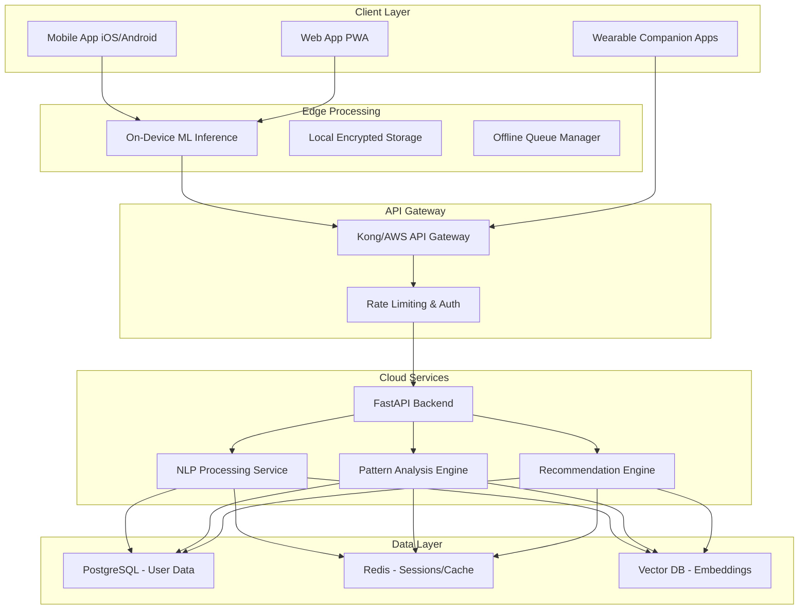
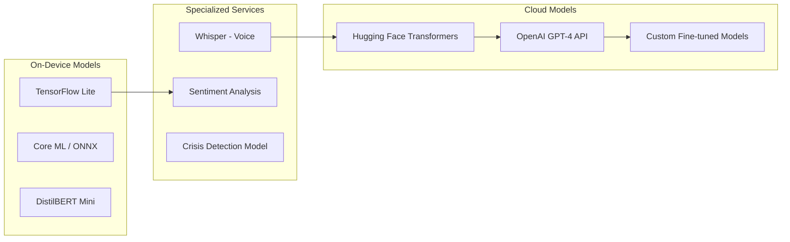
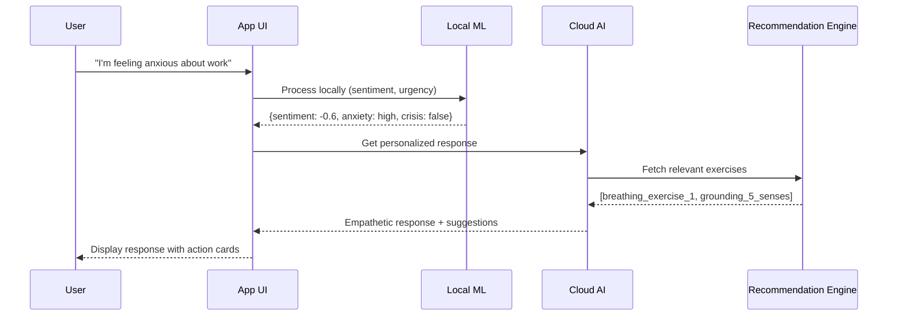
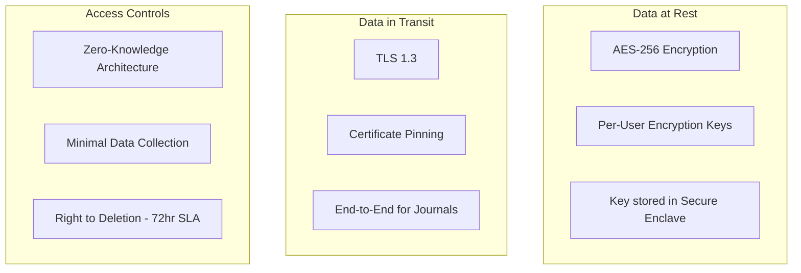

# MindFlow AI Agent - Comprehensive Design Plan

A mental wellness companion leveraging AI to provide personalized support through mood tracking, pattern analysis, and evidence-based recommendations.

---

## 1. System Architecture

### 1.1 High-Level Overview



### 1.2 Hybrid Processing Strategy (Privacy-First)

| Data Type | Processing Location | Rationale |
|-----------|---------------------|-----------|
| Raw mood logs & journal text | **On-Device** | Maximum privacy - sensitive content never leaves device |
| Extracted sentiment scores | **Cloud** (anonymized) | Pattern analysis requires aggregate processing |
| Biometric data (HR, HRV, sleep) | **On-Device** | Health data stays local, only derived insights sync |
| Conversation context | **Hybrid** | Local cache + cloud for advanced NLP features |
| Crisis detection | **Both** | On-device for speed, cloud for accuracy verification |

> [!IMPORTANT]
> **Privacy Architecture Decision**: All personally identifiable information (PII) and raw mental health data should be processed and stored on-device by default. Only anonymized, aggregated, or user-consented data reaches cloud services.

### 1.3 Backend API Structure

```
api/
├── v1/
│   ├── auth/           # JWT + OAuth2 (Google, Apple)
│   ├── users/          # Profile, preferences, consent management
│   ├── mood/           # Mood logs CRUD, trend queries
│   ├── journal/        # Encrypted journal entries
│   ├── insights/       # AI-generated patterns & analytics
│   ├── recommendations/ # Personalized exercises & suggestions
│   ├── wearables/      # Integration endpoints
│   ├── chat/           # Conversational AI interface
│   └── crisis/         # Emergency resources & detection
```

---

## 2. Key Technologies

### 2.1 Core Stack

| Layer | Technology | Justification |
|-------|------------|---------------|
| **Mobile** | React Native + Expo | Cross-platform, single codebase, good for small teams |
| **Web** | Next.js 14+ | SSR for SEO, PWA support, shared components |
| **Backend** | FastAPI (Python) | Async support, great for ML integration, auto docs |
| **Database** | PostgreSQL + pgvector | Reliable, vector similarity search built-in |
| **Cache** | Redis | Session management, rate limiting, real-time features |
| **Auth** | Supabase Auth or Auth0 | Managed auth reduces security burden |

### 2.2 AI/ML Stack



| Component | Technology | Notes |
|-----------|------------|-------|
| **NLP Pipeline** | Hugging Face Transformers | Sentiment, emotion, intent classification |
| **On-Device Inference** | TensorFlow Lite / Core ML | Quantized models for mobile |
| **Conversational AI** | OpenAI GPT-4 / Claude API | With strict guardrails & fine-tuning |
| **Voice Processing** | Whisper (local) + ElevenLabs (cloud) | Speech-to-text and emotional voice synthesis |
| **Embeddings** | Sentence Transformers + pgvector | Semantic search for relevant content |
| **Pattern Detection** | scikit-learn + Prophet | Time-series mood analysis |

### 2.3 Wearable Integrations

| Platform | API | Data Collected |
|----------|-----|----------------|
| Apple Watch | HealthKit | HR, HRV, sleep stages, activity |
| Fitbit | Fitbit Web API | Sleep score, stress management, SPO2 |
| Garmin | Garmin Connect API | Body battery, stress level |
| Samsung Galaxy Watch | Samsung Health SDK | Same as above |
| Oura Ring | Oura API v2 | Sleep, readiness, temperature |

```python
# Example: Wearable data aggregation service
class WearableDataAggregator:
    async def fetch_daily_metrics(self, user_id: str) -> WellnessMetrics:
        """Aggregates data from connected wearables into unified format."""
        metrics = []
        for provider in user.connected_providers:
            raw_data = await provider.fetch_last_24h()
            normalized = self.normalize_to_schema(raw_data, provider.type)
            metrics.append(normalized)
        return self.merge_metrics(metrics)
```

---

## 3. User Interaction Flow

### 3.1 Conversational UI Design



### 3.2 Interaction Modalities

| Mode | Implementation | Use Case |
|------|----------------|----------|
| **Text Chat** | Real-time WebSocket | Primary interaction, journaling prompts |
| **Voice Input** | Whisper on-device | Hands-free logging, accessibility |
| **Voice Output** | Neural TTS | Guided meditations, affirmations |
| **Quick Actions** | Bottom sheet widgets | Mood sliders, breathing timer, SOS |
| **Passive Sensing** | Background services | Correlate app usage with mood patterns |
| **Push Nudges** | Firebase/APNs | Gentle check-ins, habit reminders |

### 3.3 Sample Conversation Flows

````carousel
**Flow 1: Daily Check-in**
```
🌅 Good morning, Alex!
   How are you feeling today?

   😊 Great  😐 Okay  😔 Low  😰 Anxious

[User taps "Anxious"]

I hear you. Anxiety can be tough.
Would you like to:
• Try a quick breathing exercise (2 min)
• Journal about what's on your mind
• See patterns from days you felt similar

[User selects breathing exercise]

Let's do 4-7-8 breathing together...
```
<!-- slide -->
**Flow 2: Pattern Insight**
```
📊 Weekly Insight Ready

I noticed your mood tends to dip
on Monday mornings. Last 4 weeks:

Mon AM: avg 3.2/10
Other days: avg 6.8/10

Would you like to:
• Explore possible causes together
• Set a Sunday evening wind-down routine
• Schedule a Monday morning mindfulness

[Actionable recommendations based on data]
```
<!-- slide -->
**Flow 3: Crisis Support**
```
💙 I noticed you mentioned feeling
   hopeless. I want to check in—

   Are you having thoughts of
   hurting yourself?

   [Yes, I need help] [No, just venting]

[If "Yes"]

I'm here with you. Let's connect you
with someone who can help right now:

📞 988 Suicide & Crisis Lifeline
   [Call Now] [Text Instead]

🏥 Find nearby crisis center
   [Open Map]

Would you like me to stay with you
while you reach out?
```
````

---

## 4. Ethical Framework

### 4.1 Bias Mitigation Strategy

| Risk Area | Mitigation Approach |
|-----------|---------------------|
| **Training Data Bias** | Curate diverse datasets; audit for demographic representation; use debiasing techniques (adversarial training) |
| **Cultural Sensitivity** | Partner with mental health professionals from diverse backgrounds; localize content beyond translation |
| **Socioeconomic Bias** | Ensure core features work offline; don't gate crisis support behind premium |
| **Gender/Age Bias** | Regular fairness audits across demographic splits; diverse user testing panels |

> [!WARNING]
> **Critical**: Never use AI to diagnose mental health conditions. Always position as "wellness companion" with clear disclaimers and professional referral pathways.

### 4.2 Data Security Architecture



| Security Measure | Implementation |
|------------------|----------------|
| **Encryption** | AES-256 at rest, TLS 1.3 in transit |
| **Key Management** | User-controlled keys in device Secure Enclave |
| **Zero-Knowledge Journals** | E2E encrypted; server cannot read content |
| **Anonymization** | k-anonymity for any aggregated analytics |
| **Audit Logging** | Immutable logs of all data access |
| **Compliance** | HIPAA-ready architecture, GDPR compliant |

### 4.3 Consent & Transparency

```
Required User Consents (Granular):
┌─────────────────────────────────────────────────┐
│ ☑ Core mood tracking (required)                 │
│ ☐ Wearable data integration (optional)          │
│ ☐ Voice journaling (optional)                   │
│ ☐ Anonymized data for model improvement         │
│ ☐ Share weekly reports with therapist           │
└─────────────────────────────────────────────────┘

Each toggle includes:
• Plain-language explanation
• "Learn more" with examples
• Easy revocation at any time
```

---

## 5. Scalability & Testing

### 5.1 Infrastructure Scaling

| Load Level | Architecture | Notes |
|------------|--------------|-------|
| **0-10K users** | Single region, basic Kubernetes | Focus on product-market fit |
| **10K-100K** | Multi-AZ, read replicas, CDN | Add Redis cluster for sessions |
| **100K-1M** | Multi-region, sharded DB | Regional inference endpoints |
| **1M+** | Global edge, custom ML infra | Consider dedicated ML clusters |

### 5.2 Testing Strategy

| Test Type | Scope | Tools |
|-----------|-------|-------|
| **Unit Tests** | Business logic, utilities | pytest, Jest |
| **Integration Tests** | API endpoints, DB operations | pytest + httpx, Supertest |
| **ML Model Tests** | Accuracy, bias, drift detection | Great Expectations, MLflow |
| **E2E Tests** | Critical user flows | Detox (mobile), Playwright (web) |
| **Load Tests** | API performance | k6, Locust |
| **Security Tests** | OWASP, penetration | OWASP ZAP, manual audits |

### 5.3 A/B Testing Framework

```python
class ExperimentManager:
    """Manages A/B tests for AI responses and features."""
    
    experiments = {
        "meditation_prompt_style": {
            "variants": ["formal", "casual", "poetic"],
            "metric": "completion_rate",
            "min_sample": 1000		
        },
        "crisis_detection_threshold": {
            "variants": [0.7, 0.8, 0.9],
            "metric": "false_positive_rate",
            "safety_guardrail": True  # Never degrade crisis detection
        }
    }
```

> [!CAUTION]
> **A/B Testing Ethics**: Never A/B test crisis features or withhold beneficial content. Use only for optimizing delivery, not outcomes. All variants must meet minimum safety/efficacy standards.

### 5.4 Demographic Testing

- **User Panels**: Recruit diverse beta testers across age, gender, culture, mental health history
- **Accessibility Testing**: Screen reader compatibility, color blindness, motor impairments
- **Localization QA**: Cultural appropriateness of AI responses per region

---

## 6. Monetization Strategy

### 6.1 Tiered Feature Matrix

| Feature | Free | Premium ($9.99/mo) | Premium+ ($14.99/mo) |
|---------|------|--------------------|-----------------------|
| Mood logging & basic insights | ✅ | ✅ | ✅ |
| Daily check-ins | ✅ | ✅ | ✅ |
| Crisis resources | ✅ | ✅ | ✅ |
| AI chat (limited) | 10/day | Unlimited | Unlimited |
| Advanced pattern analytics | ❌ | ✅ | ✅ |
| Wearable integrations | 1 device | Unlimited | Unlimited |
| Voice journaling | ❌ | ✅ | ✅ |
| Therapist sharing tools | ❌ | ❌ | ✅ |
| Family/caregiver account | ❌ | ❌ | ✅ |
| Priority AI processing | ❌ | ❌ | ✅ |

> [!IMPORTANT]
> **Ethical Monetization Principle**: Core safety features (crisis detection, emergency resources, basic mood tracking) must ALWAYS be free. Never paywall help-seeking behavior.

### 6.2 B2B Opportunities

| Channel | Offering | Revenue Model |
|---------|----------|---------------|
| **Employers** | Workplace wellness program integration | Per-employee subscription |
| **Healthcare** | EHR integration, clinical version | Enterprise licensing |
| **Telehealth** | Companion to therapy platforms | Revenue share |
| **Insurance** | Preventive care partnerships | Outcome-based pricing |

### 6.3 Revenue Projections (Conservative)

```
Year 1: Focus on user acquisition, minimal monetization
- Target: 50K users, 5% conversion = $250K ARR

Year 2: Premium features, initial B2B pilots
- Target: 200K users, 8% conversion = $1.6M ARR
- B2B pilots: $200K

Year 3: Scale B2B, international expansion
- Target: 500K users, 10% conversion = $5M ARR
- B2B: $2M ARR
```

---

## 7. Implementation Roadmap

### Phase 1: MVP (Months 1-3)
- [ ] Core mobile app (React Native)
- [ ] Basic mood logging & journaling
- [ ] Simple sentiment analysis (on-device)
- [ ] Static content library (exercises, tips)
- [ ] User auth & encryption

### Phase 2: AI Integration (Months 4-6)
- [ ] Conversational AI chat (GPT-4 with guardrails)
- [ ] Pattern detection algorithms
- [ ] First wearable integration (Apple HealthKit)
- [ ] Crisis detection v1
- [ ] Basic analytics dashboard

### Phase 3: Personalization (Months 7-9)
- [ ] Recommendation engine
- [ ] Voice input/output
- [ ] Additional wearable integrations
- [ ] A/B testing framework
- [ ] Premium tier launch

### Phase 4: Scale (Months 10-12)
- [ ] B2B pilot program
- [ ] Multi-language support
- [ ] Advanced ML models (fine-tuned)
- [ ] Compliance certifications (HIPAA)
- [ ] Web app PWA

---

## 8. Small Team Considerations

### Recommended Team Structure (5-7 people)

| Role | Responsibilities | Count |
|------|------------------|-------|
| **Full-Stack Lead** | Architecture, backend, DevOps | 1 |
| **Mobile Developer** | React Native, on-device ML | 1-2 |
| **ML Engineer** | NLP models, training pipelines | 1 |
| **Product Designer** | UX, content strategy | 1 |
| **Mental Health Advisor** | Content review, ethics, clinical guidance | 0.5 (contractor) |
| **QA/Security** | Testing, compliance | 0.5-1 |

### Cost-Optimization Tips

1. **Use managed services**: Supabase, Railway, or Render instead of raw AWS
2. **Start with API models**: Use OpenAI/Anthropic APIs before investing in custom training
3. **Open-source ML**: Leverage Hugging Face models, fine-tune minimally
4. **Serverless where possible**: Lambda for sporadic workloads
5. **CDN for static content**: Cloudflare free tier for meditations, images

---

## Verification Plan

Since this is a planning/design document (not code implementation), verification will be:

### Review Checklist
- [ ] Architecture addresses privacy requirements (hybrid processing)
- [ ] Technology choices are feasible for small team
- [ ] Ethical framework covers key risk areas
- [ ] Monetization doesn't conflict with user safety
- [ ] Timeline is realistic for team size
- [ ] All major user flows are documented

### Manual Review Required
- User to confirm alignment with their vision for MindFlow
- Validate technology preferences (e.g., React Native vs Flutter)
- Confirm budget constraints for cloud services
- Verify target user demographics match design assumptions

---

## Questions for User Review

1. **Target Platform Priority**: Should we focus on iOS-first, Android-first, or true cross-platform from day one?

2. **AI Model Preference**: Are you comfortable using cloud AI APIs (OpenAI/Anthropic) initially, or is fully on-device processing a hard requirement for v1?

3. **Wearable Priority**: Which wearable ecosystem is most important for your target users?

4. **Compliance Requirements**: Do you need HIPAA compliance from launch, or can this be a Phase 3-4 addition?

5. **Existing Assets**: Do you have any existing codebase, designs, or content library to integrate?
