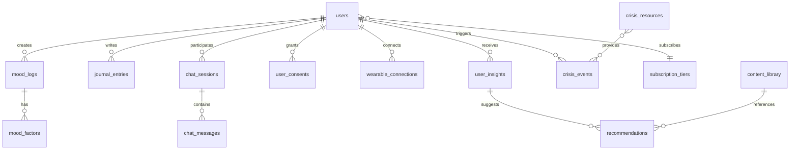

# MindFlow Backend - Detailed Implementation Plan

A production-ready FastAPI backend for the MindFlow mental wellness platform.

---

## 1. Project Structure

```
mindflow-backend/
├── app/
│   ├── __init__.py
│   ├── main.py                    # FastAPI app entry point
│   ├── config.py                  # Settings & environment config
│   ├── database.py                # DB connection & session management
│   │
│   ├── api/
│   │   ├── __init__.py
│   │   ├── deps.py                # Shared dependencies (auth, db session)
│   │   └── v1/
│   │       ├── __init__.py
│   │       ├── router.py          # Main v1 router aggregator
│   │       ├── auth.py            # Authentication endpoints
│   │       ├── users.py           # User profile & settings
│   │       ├── mood.py            # Mood logging endpoints
│   │       ├── journal.py         # Journal entries (encrypted)
│   │       ├── insights.py        # AI-generated analytics
│   │       ├── recommendations.py # Personalized suggestions
│   │       ├── chat.py            # Conversational AI
│   │       ├── wearables.py       # Wearable integrations
│   │       └── crisis.py          # Crisis detection & resources
│   │
│   ├── models/                    # SQLAlchemy ORM models
│   │   ├── __init__.py
│   │   ├── user.py
│   │   ├── mood.py
│   │   ├── journal.py
│   │   ├── insight.py
│   │   ├── recommendation.py
│   │   ├── chat.py
│   │   ├── wearable.py
│   │   └── crisis.py
│   │
│   ├── schemas/                   # Pydantic request/response schemas
│   │   ├── __init__.py
│   │   ├── auth.py
│   │   ├── user.py
│   │   ├── mood.py
│   │   ├── journal.py
│   │   ├── insight.py
│   │   ├── recommendation.py
│   │   ├── chat.py
│   │   ├── wearable.py
│   │   └── crisis.py
│   │
│   ├── services/                  # Business logic layer
│   │   ├── __init__.py
│   │   ├── auth_service.py
│   │   ├── user_service.py
│   │   ├── mood_service.py
│   │   ├── journal_service.py
│   │   ├── insight_service.py
│   │   ├── recommendation_service.py
│   │   ├── chat_service.py
│   │   ├── wearable_service.py
│   │   └── crisis_service.py
│   │
│   ├── ml/                        # ML/AI integration layer
│   │   ├── __init__.py
│   │   ├── sentiment.py           # Sentiment analysis
│   │   ├── emotion.py             # Emotion classification
│   │   ├── pattern_detector.py    # Time-series mood patterns
│   │   ├── crisis_detector.py     # Crisis keyword/intent detection
│   │   ├── embeddings.py          # Text embedding generation
│   │   └── llm_client.py          # OpenAI/Anthropic API wrapper
│   │
│   ├── integrations/              # External API integrations
│   │   ├── __init__.py
│   │   ├── oauth_providers.py     # Google, Apple OAuth
│   │   ├── fitbit.py
│   │   ├── garmin.py
│   │   ├── oura.py
│   │   └── apple_health.py
│   │
│   └── utils/
│       ├── __init__.py
│       ├── security.py            # Password hashing, JWT, encryption
│       ├── rate_limiter.py        # Redis-based rate limiting
│       ├── validators.py          # Custom validation helpers
│       └── exceptions.py          # Custom exception classes
│
├── alembic/                       # Database migrations
│   ├── versions/
│   └── env.py
│
├── tests/
│   ├── conftest.py                # Fixtures
│   ├── test_auth.py
│   ├── test_mood.py
│   ├── test_chat.py
│   └── ...
│
├── scripts/
│   ├── seed_content.py            # Seed exercises, tips
│   └── migrate.py                 # Migration helper
│
├── docker/
│   ├── Dockerfile
│   └── docker-compose.yml
│
├── .env.example
├── requirements.txt
├── pyproject.toml
└── README.md
```

---

## 2. Database Schema

### 2.1 Entity Relationship Diagram



### 2.2 Table Definitions

#### Core User Tables

```sql
-- Users table with privacy-first design
CREATE TABLE users (
    id UUID PRIMARY KEY DEFAULT gen_random_uuid(),
    email VARCHAR(255) UNIQUE NOT NULL,
    email_verified BOOLEAN DEFAULT FALSE,
    password_hash VARCHAR(255),  -- NULL if OAuth-only
    display_name VARCHAR(100),
    avatar_url VARCHAR(500),
    timezone VARCHAR(50) DEFAULT 'UTC',
    locale VARCHAR(10) DEFAULT 'en-US',
    
    -- Subscription
    subscription_tier VARCHAR(20) DEFAULT 'free',
    subscription_expires_at TIMESTAMPTZ,
    
    -- Privacy settings
    anonymous_id VARCHAR(64) UNIQUE NOT NULL,
    data_retention_days INTEGER DEFAULT 365,
    
    -- Metadata
    created_at TIMESTAMPTZ DEFAULT NOW(),
    updated_at TIMESTAMPTZ DEFAULT NOW(),
    last_active_at TIMESTAMPTZ,
    deleted_at TIMESTAMPTZ
);

-- Granular user consents
CREATE TABLE user_consents (
    id UUID PRIMARY KEY DEFAULT gen_random_uuid(),
    user_id UUID REFERENCES users(id) ON DELETE CASCADE,
    consent_type VARCHAR(50) NOT NULL,
    granted BOOLEAN DEFAULT FALSE,
    granted_at TIMESTAMPTZ,
    revoked_at TIMESTAMPTZ,
    ip_address INET,
    user_agent TEXT,
    UNIQUE(user_id, consent_type)
);

-- OAuth connections
CREATE TABLE oauth_connections (
    id UUID PRIMARY KEY DEFAULT gen_random_uuid(),
    user_id UUID REFERENCES users(id) ON DELETE CASCADE,
    provider VARCHAR(20) NOT NULL,
    provider_user_id VARCHAR(255) NOT NULL,
    access_token_encrypted BYTEA,
    refresh_token_encrypted BYTEA,
    token_expires_at TIMESTAMPTZ,
    created_at TIMESTAMPTZ DEFAULT NOW(),
    UNIQUE(provider, provider_user_id)
);
```

#### Mood & Journal Tables

```sql
-- Mood logs with rich metadata
CREATE TABLE mood_logs (
    id UUID PRIMARY KEY DEFAULT gen_random_uuid(),
    user_id UUID REFERENCES users(id) ON DELETE CASCADE,
    mood_score SMALLINT NOT NULL CHECK (mood_score BETWEEN 1 AND 10),
    energy_level SMALLINT CHECK (energy_level BETWEEN 1 AND 10),
    anxiety_level SMALLINT CHECK (anxiety_level BETWEEN 1 AND 10),
    note TEXT,
    note_sentiment FLOAT,
    logged_at TIMESTAMPTZ NOT NULL DEFAULT NOW(),
    time_of_day VARCHAR(20),
    day_of_week SMALLINT,
    location_type VARCHAR(30),
    processed_for_insights BOOLEAN DEFAULT FALSE,
    crisis_flag_triggered BOOLEAN DEFAULT FALSE,
    created_at TIMESTAMPTZ DEFAULT NOW()
);

-- Mood contributing factors
CREATE TABLE mood_factors (
    id UUID PRIMARY KEY DEFAULT gen_random_uuid(),
    mood_log_id UUID REFERENCES mood_logs(id) ON DELETE CASCADE,
    factor_type VARCHAR(30) NOT NULL,
    factor_value VARCHAR(50),
    impact_score SMALLINT CHECK (impact_score BETWEEN -5 AND 5)
);

-- Encrypted journal entries
CREATE TABLE journal_entries (
    id UUID PRIMARY KEY DEFAULT gen_random_uuid(),
    user_id UUID REFERENCES users(id) ON DELETE CASCADE,
    content_encrypted BYTEA NOT NULL,
    content_iv BYTEA NOT NULL,
    content_hash VARCHAR(64),
    word_count INTEGER,
    entry_type VARCHAR(20) DEFAULT 'freeform',
    prompt_id UUID,
    sentiment_score FLOAT,
    primary_emotion VARCHAR(30),
    topics JSONB,
    created_at TIMESTAMPTZ DEFAULT NOW(),
    updated_at TIMESTAMPTZ DEFAULT NOW()
);

CREATE INDEX idx_mood_logs_user_time ON mood_logs(user_id, logged_at DESC);
CREATE INDEX idx_journal_user_time ON journal_entries(user_id, created_at DESC);
```

#### Chat & AI Tables

```sql
-- Chat sessions
CREATE TABLE chat_sessions (
    id UUID PRIMARY KEY DEFAULT gen_random_uuid(),
    user_id UUID REFERENCES users(id) ON DELETE CASCADE,
    title VARCHAR(100),
    session_type VARCHAR(30) DEFAULT 'general',
    context_summary TEXT,
    mood_context JSONB,
    is_active BOOLEAN DEFAULT TRUE,
    message_count INTEGER DEFAULT 0,
    created_at TIMESTAMPTZ DEFAULT NOW(),
    last_message_at TIMESTAMPTZ
);

-- Chat messages
CREATE TABLE chat_messages (
    id UUID PRIMARY KEY DEFAULT gen_random_uuid(),
    session_id UUID REFERENCES chat_sessions(id) ON DELETE CASCADE,
    role VARCHAR(10) NOT NULL,
    content TEXT NOT NULL,
    model_used VARCHAR(50),
    tokens_used INTEGER,
    response_time_ms INTEGER,
    crisis_detected BOOLEAN DEFAULT FALSE,
    content_filtered BOOLEAN DEFAULT FALSE,
    embedding vector(1536),
    created_at TIMESTAMPTZ DEFAULT NOW()
);

CREATE INDEX idx_chat_messages_embedding ON chat_messages 
    USING ivfflat (embedding vector_cosine_ops);
```

#### Insights & Recommendations

```sql
-- AI-generated insights
CREATE TABLE user_insights (
    id UUID PRIMARY KEY DEFAULT gen_random_uuid(),
    user_id UUID REFERENCES users(id) ON DELETE CASCADE,
    insight_type VARCHAR(30) NOT NULL,
    title VARCHAR(200) NOT NULL,
    description TEXT NOT NULL,
    data_points JSONB,
    confidence_score FLOAT,
    shown_at TIMESTAMPTZ,
    dismissed_at TIMESTAMPTZ,
    helpful_rating SMALLINT,
    valid_from TIMESTAMPTZ DEFAULT NOW(),
    valid_until TIMESTAMPTZ,
    created_at TIMESTAMPTZ DEFAULT NOW()
);

-- Content library
CREATE TABLE content_library (
    id UUID PRIMARY KEY DEFAULT gen_random_uuid(),
    content_type VARCHAR(30) NOT NULL,
    title VARCHAR(200) NOT NULL,
    description TEXT,
    content_body TEXT,
    duration_minutes SMALLINT,
    difficulty VARCHAR(20),
    target_moods JSONB,
    target_factors JSONB,
    audio_url VARCHAR(500),
    image_url VARCHAR(500),
    is_premium BOOLEAN DEFAULT FALSE,
    is_active BOOLEAN DEFAULT TRUE,
    view_count INTEGER DEFAULT 0,
    avg_rating FLOAT,
    created_at TIMESTAMPTZ DEFAULT NOW()
);

-- Personalized recommendations
CREATE TABLE recommendations (
    id UUID PRIMARY KEY DEFAULT gen_random_uuid(),
    user_id UUID REFERENCES users(id) ON DELETE CASCADE,
    insight_id UUID REFERENCES user_insights(id),
    content_id UUID REFERENCES content_library(id),
    reason TEXT,
    priority SMALLINT DEFAULT 5,
    shown_at TIMESTAMPTZ,
    clicked_at TIMESTAMPTZ,
    completed_at TIMESTAMPTZ,
    feedback VARCHAR(20),
    expires_at TIMESTAMPTZ,
    created_at TIMESTAMPTZ DEFAULT NOW()
);
```

#### Wearables & Crisis

```sql
-- Wearable connections
CREATE TABLE wearable_connections (
    id UUID PRIMARY KEY DEFAULT gen_random_uuid(),
    user_id UUID REFERENCES users(id) ON DELETE CASCADE,
    provider VARCHAR(30) NOT NULL,
    provider_user_id VARCHAR(255),
    access_token_encrypted BYTEA,
    refresh_token_encrypted BYTEA,
    token_expires_at TIMESTAMPTZ,
    scopes JSONB,
    last_sync_at TIMESTAMPTZ,
    sync_status VARCHAR(20) DEFAULT 'active',
    sync_error TEXT,
    created_at TIMESTAMPTZ DEFAULT NOW()
);

-- Wearable metrics
CREATE TABLE wearable_metrics (
    id UUID PRIMARY KEY DEFAULT gen_random_uuid(),
    user_id UUID REFERENCES users(id) ON DELETE CASCADE,
    connection_id UUID REFERENCES wearable_connections(id),
    metric_date DATE NOT NULL,
    sleep_duration_minutes INTEGER,
    sleep_quality_score SMALLINT,
    deep_sleep_minutes INTEGER,
    rem_sleep_minutes INTEGER,
    steps INTEGER,
    active_minutes INTEGER,
    calories_burned INTEGER,
    avg_heart_rate INTEGER,
    hrv_avg FLOAT,
    stress_score SMALLINT,
    readiness_score SMALLINT,
    created_at TIMESTAMPTZ DEFAULT NOW(),
    UNIQUE(user_id, metric_date, connection_id)
);

-- Crisis events
CREATE TABLE crisis_events (
    id UUID PRIMARY KEY DEFAULT gen_random_uuid(),
    user_id UUID REFERENCES users(id) ON DELETE CASCADE,
    trigger_source VARCHAR(30) NOT NULL,
    trigger_content_hash VARCHAR(64),
    severity VARCHAR(20) NOT NULL,
    detection_confidence FLOAT,
    resources_shown JSONB,
    resource_clicked VARCHAR(50),
    hotline_called BOOLEAN DEFAULT FALSE,
    resolved_at TIMESTAMPTZ,
    resolution_type VARCHAR(30),
    follow_up_scheduled BOOLEAN DEFAULT FALSE,
    created_at TIMESTAMPTZ DEFAULT NOW()
);

-- Crisis resources
CREATE TABLE crisis_resources (
    id UUID PRIMARY KEY DEFAULT gen_random_uuid(),
    name VARCHAR(200) NOT NULL,
    description TEXT,
    resource_type VARCHAR(30) NOT NULL,
    phone_number VARCHAR(20),
    sms_number VARCHAR(20),
    website_url VARCHAR(500),
    available_24_7 BOOLEAN DEFAULT FALSE,
    available_hours JSONB,
    countries JSONB,
    languages JSONB,
    specializations JSONB,
    is_active BOOLEAN DEFAULT TRUE,
    priority SMALLINT DEFAULT 5,
    created_at TIMESTAMPTZ DEFAULT NOW()
);
```

---

## 3. API Endpoints

### 3.1 Authentication (`/api/v1/auth`)

| Method | Endpoint | Description |
|--------|----------|-------------|
| POST | `/register` | Email/password registration |
| POST | `/login` | Email/password login |
| POST | `/logout` | Invalidate refresh token |
| POST | `/refresh` | Refresh access token |
| POST | `/oauth/{provider}` | OAuth login (google, apple) |
| POST | `/forgot-password` | Request password reset |
| DELETE | `/account` | Request account deletion |

### 3.2 Mood (`/api/v1/mood`)

| Method | Endpoint | Description |
|--------|----------|-------------|
| POST | `/logs` | Create mood log |
| GET | `/logs` | List mood logs (paginated) |
| GET | `/logs/{id}` | Get single mood log |
| PATCH | `/logs/{id}` | Update mood log |
| DELETE | `/logs/{id}` | Delete mood log |
| GET | `/stats` | Aggregated statistics |
| GET | `/trends` | Mood trends over time |
| GET | `/factors` | Factor correlations (Premium) |

### 3.3 Chat (`/api/v1/chat`)

| Method | Endpoint | Description |
|--------|----------|-------------|
| POST | `/sessions` | Start new session |
| GET | `/sessions` | List sessions |
| GET | `/sessions/{id}` | Get session with messages |
| DELETE | `/sessions/{id}` | Delete session |
| POST | `/sessions/{id}/messages` | Send message, get AI response |
| WS | `/ws/{session_id}` | Real-time WebSocket chat |

### 3.4 Insights & Recommendations

| Method | Endpoint | Description |
|--------|----------|-------------|
| GET | `/insights` | Get user's insights |
| POST | `/insights/{id}/feedback` | Rate insight |
| GET | `/recommendations` | Get recommendations |
| POST | `/recommendations/{id}/complete` | Mark completed |

### 3.5 Wearables (`/api/v1/wearables`)

| Method | Endpoint | Description |
|--------|----------|-------------|
| GET | `/providers` | List available providers |
| POST | `/connect/{provider}` | Initiate OAuth |
| GET | `/connections` | List connections |
| DELETE | `/connections/{id}` | Disconnect |
| GET | `/metrics` | Get aggregated metrics |

### 3.6 Crisis (`/api/v1/crisis`)

| Method | Endpoint | Description |
|--------|----------|-------------|
| GET | `/resources` | Get crisis resources |
| POST | `/check` | Manual crisis self-check |
| GET | `/safety-plan` | Get safety plan |
| PUT | `/safety-plan` | Update safety plan |

---

## 4. Service Layer

```python
# services/mood_service.py
class MoodService(BaseService):
    
    async def create_log(self, data: MoodLogCreate) -> MoodLog:
        log = MoodLog(user_id=self.current_user.id, **data.dict())
        
        if data.note:
            sentiment = await self.ml_service.analyze_sentiment(data.note)
            log.note_sentiment = sentiment.score
            
            if sentiment.crisis_indicators:
                await self.crisis_service.handle_detection(
                    user_id=self.current_user.id,
                    source="mood_log"
                )
                log.crisis_flag_triggered = True
        
        self.db.add(log)
        await self.commit()
        return log
```

```python
# services/chat_service.py
class ChatService(BaseService):
    
    async def send_message(self, session_id: UUID, content: str) -> ChatAIResponse:
        # 1. Save user message
        # 2. Crisis detection
        # 3. Build LLM context
        # 4. Generate response with guardrails
        # 5. Save assistant message
        # 6. Return with action cards
```

---

## 5. ML Integration

### Sentiment Analysis
- **Model**: `cardiffnlp/twitter-roberta-base-sentiment`
- **Location**: Hugging Face Inference API (or local)
- **Output**: Score (-1 to 1), crisis indicators

### LLM with Guardrails
- **Provider**: OpenAI GPT-4-turbo
- **Guardrails**:
  - Never diagnose conditions
  - Always suggest professional help
  - Crisis response priority
  - No medication advice

### Pattern Detection
- **Library**: Prophet + scikit-learn
- **Patterns**: Weekly cycles, time-of-day, factor correlations

---

## 6. Deployment

```yaml
# docker-compose.yml
services:
  api:
    build: .
    ports: ["8000:8000"]
    depends_on: [db, redis]
    
  db:
    image: pgvector/pgvector:pg16
    volumes: [postgres_data:/var/lib/postgresql/data]
    
  redis:
    image: redis:7-alpine
```

---

## 7. Implementation Phases

### Phase 1: Foundation (Weeks 1-3)
- [ ] Project setup, Docker, CI/CD
- [ ] Database schema + migrations
- [ ] Auth endpoints
- [ ] Basic mood logging CRUD

### Phase 2: Core (Weeks 4-6)
- [ ] Journal with encryption
- [ ] Mood stats & trends
- [ ] Sentiment analysis
- [ ] Content library

### Phase 3: AI (Weeks 7-9)
- [ ] Chat with LLM
- [ ] Crisis detection
- [ ] Pattern detection
- [ ] Insights generation

### Phase 4: Integrations (Weeks 10-12)
- [ ] Wearable OAuth + sync
- [ ] WebSocket chat
- [ ] Rate limiting
- [ ] Premium gating

---

## Questions

1. **Database**: PostgreSQL + pgvector or Supabase?
2. **Auth**: Build JWT or use Auth0?
3. **LLM**: OpenAI GPT-4 or Anthropic Claude?
4. **Hosting**: Railway/Render or AWS/GCP?
